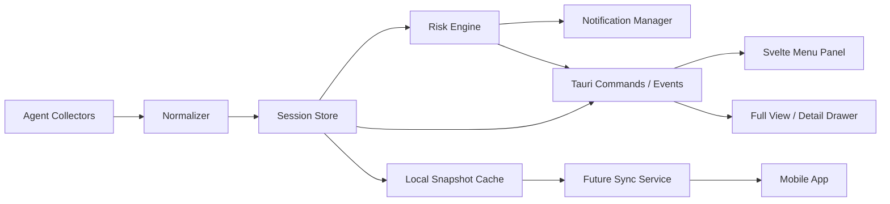

# LoopPulse Agent Monitor PRD

版本：v0.1 草案  
日期：2026-06-03  
状态：待评审  
参考：abtop v0.4.7、CleanMyMac 菜单栏面板体验  

> 修订记录：2026-06-22 更新「Alert Types」一节——context 使用率改为仅展示/软提示（不告警），
> 周期限额预警改为可配置两档 + per-session 风险。详见 DEV_NOTES.md「2026-06-22 全局诊断后的一轮修复」。

## 1. Executive Summary

### Problem Statement

AI Agent 已经成为长时间运行的开发执行体，但用户很难在不切换终端、不翻日志、不逐个查看 session 的情况下判断 Agent 是否正常工作、是否假死、是否即将耗尽上下文、是否异常消耗 token、是否遗留端口或子进程。

现有 abtop 以 TUI 方式提供了很强的本地观测能力，但它更适合终端内全屏查看；LoopPulse 要把这些能力重构成一个常驻菜单栏、可通知、可远程同步的桌面端监控中心。

### Proposed Solution

LoopPulse 提供一个 CleanMyMac 风格的 macOS 菜单栏面板：默认展示 Agent 健康总览、活跃 session 列表和关键风险提示；点击 session 进入详情视图，展示上下文、token、工具调用、文件访问、子进程、端口、错误和限流信息。

系统在后台持续采集本地 Agent 状态，基于规则引擎识别异常，并通过菜单栏图标、面板状态、桌面通知和未来的移动端推送提醒用户。

### Success Criteria

- P0 版本能够稳定发现 Claude Code 和 Codex CLI 的活跃 session，刷新延迟 <= 3 秒。
- 对 context 高水位、限流、长时间无进展、异常 token 增长、遗留端口等核心风险给出明确提醒，误报率在人工验证样本中 <= 20%。
- 菜单栏缩略面板打开时间 <= 300ms，常驻后台 CPU 平均占用 <= 3%，内存 <= 150MB。
- 用户无需打开终端即可判断“当前所有 Agent 是否正常”，核心状态识别准确率 >= 90%。
- v1.0 预留远程同步接口，使未来手机端可在 10 秒内看到桌面端 Agent 状态变化。

## 2. User Experience & Functionality

### User Personas

- 独立开发者：同时运行多个 Claude / Codex session，希望快速知道哪个在工作、哪个卡住、哪个快爆上下文。
- AI-first 工程师：让 Agent 长时间执行任务，需要异常通知，而不是反复盯终端。
- 团队技术负责人：未来希望远程查看机器上 Agent 的运行状态和风险，但不希望泄露代码内容。
- 高级本地工具用户：关注端口、子进程、文件访问、MCP server、限流和 token 成本。

### User Stories

**Story 1：全局健康总览**  
As a developer, I want to see all active agents from the menu bar so that I can know whether my AI workers are healthy without switching terminals.

Acceptance Criteria:
- 菜单栏图标可表达总体状态：正常、工作中、警告、错误。
- 面板顶部显示总 session 数、活跃数、异常数、今日 token 总量。
- 无 session 时显示空态和最近一次刷新时间。
- 状态变化在 3 秒内反映到 UI。

**Story 2：session 列表与缩略监控**  
As a developer, I want a compact list of sessions so that I can scan project, status, model, token, and context at a glance.

Acceptance Criteria:
- 每个 session 卡片展示 Agent 类型、项目名、运行状态、运行时长、模型、token 总量、context 百分比。
- 状态至少包含：思考中、执行中、等待输入、限流、疑似假死、错误、已结束。
- 卡片支持风险徽标，例如 context 高、token 异常、端口残留、长时间无输出。
- 默认缩略视图最多展示 4-6 个 session，超出后提供滚动或“完整视图”入口。

**Story 3：异常通知**  
As a developer, I want alerts only when something actionable happens so that I do not miss failures or get spammed.

Acceptance Criteria:
- 支持桌面通知：疑似假死、context 超阈值、限流、错误、任务完成、token 消耗异常、端口残留。
- 通知需要去重和冷却时间，同一 session 同类告警默认 10 分钟内不重复弹出。
- 用户可在设置中关闭某类通知或调整阈值。
- 点击通知打开对应 session 详情。

**Story 4：session 详情视图**  
As a developer, I want to inspect a problematic session so that I can decide whether to intervene.

Acceptance Criteria:
- 详情页展示基础信息、token 分解、context 历史、状态时间线、当前任务、最近工具调用。
- 子进程、端口、文件访问、MCP server、subagents 按模块折叠展示。
- 对敏感内容默认脱敏：不直接展示完整 prompt、文件内容或密钥。
- 详情页提供“复制诊断摘要”，用于反馈或调试。

**Story 5：风险诊断**  
As a developer, I want the app to tell me why a session is risky so that I do not need to infer from raw numbers.

Acceptance Criteria:
- 每个风险都给出明确原因，例如“20 分钟无新工具调用且 CPU 接近 0%”。
- 风险等级分为 info、warning、critical。
- 风险规则可解释，详情页展示触发条件和最近证据。

**Story 6：设置和个性化**  
As a power user, I want to control what is monitored so that the app fits my workflow.

Acceptance Criteria:
- 设置中可配置启用的 Agent 类型、Claude 配置目录、刷新频率、通知类型、阈值。
- 可隐藏指定项目、目录或 agent。
- 可选择是否显示敏感字段，如初始 prompt 摘要、文件路径、完整命令。
- 支持开机启动。

**Story 7：未来远程查看**  
As a developer away from my desk, I want to see whether agents are still running so that I can intervene or relax.

Acceptance Criteria:
- 桌面端具备本地状态快照和事件流输出能力。
- 远程同步默认关闭，需要用户显式启用。
- 手机端只能看到用户允许同步的字段。
- 远程链路不得上传文件内容、完整 prompt 或 API key。

**Story 8：免费版和付费版升级**  
As a user, I want the free version to be genuinely useful before paying so that I can trust the product and upgrade when I need professional monitoring.

Acceptance Criteria:
- 免费版必须能完成核心目标：看到本机 Agent 是否在运行、是否异常、是否需要用户介入。
- 付费入口不得阻断基础监控流程；升级提示应出现在高级能力入口、历史数据、远程同步和专业告警处。
- 付费后解锁全部专业功能，不再通过多个复杂套餐拆分体验。
- 所有付费能力需要清晰说明价值：更深诊断、更长历史、更强通知、更低打扰、更远程。

### Monetization Strategy

产品采用两档：免费版和 Pro 付费版。免费版负责扩大用户入口，必须“好用且够用”；Pro 版负责提供专业监控、深度诊断、历史分析、远程联动和更好的通知体验。

定价原则:
- 免费版不做残缺演示版，而是一个可信赖的本地 Agent 状态面板。
- 基础安全提醒不应全部收费，否则用户在最需要产品价值时感受不到价值。
- 付费点应围绕“专业、规模、历史、远程、低打扰、可配置”展开。
- 付费后解锁全部功能，避免把用户卡在细碎的二次付费里。
- P0 可以先实现功能分层逻辑和 UI 标记，具体支付/License 校验可以后置。

### Free vs Pro Feature Split

| 功能类别 | 免费版 | Pro 付费版 |
| --- | --- | --- |
| 本机 Agent 发现 | Claude Code、Codex CLI 基础发现 | 全 Agent 支持：Claude、Codex、OpenCode，以及未来新增 Agent |
| 菜单栏缩略视图 | 可用：总览、session 列表、基础状态 | 解锁完整状态徽标、更多密度选项、完整视图入口 |
| 基础状态 | 运行中、等待、执行中、限流、错误 | 增强状态：疑似假死、等待用户确认、工具执行阶段、MCP 异常 |
| token 展示 | 当前 session token 总量、输入/输出基础统计 | token 趋势、异常增长检测、按项目/Agent 汇总、历史报表 |
| context 展示 | 当前 context 百分比和高水位提醒 | context 历史曲线、压缩次数、预测剩余可用空间、项目级排行 |
| 通知 | 基础通知：任务完成、限流、context critical、明显错误 | 高级通知：自定义阈值、冷却、合并、升级策略、quiet hours、通知模板 |
| 假死检测 | 简化规则：长时间无活动提醒 | 多信号规则：transcript、CPU、子进程、工具调用、token rate 综合判断 |
| session 详情 | 基础详情：项目、目录、模型、运行时长、状态原因 | 完整详情：timeline、工具耗时、文件访问、子进程、端口、MCP、subagents |
| 错误报警 | 最近错误提示 | 错误分类、重复错误聚合、命令失败原因、诊断摘要 |
| 子进程 / 端口 | 当前开放端口基础提示 | orphan port、端口冲突、子进程资源异常、风险解释 |
| Git 状态 | 当前分支和 dirty 提示 | 项目级 Git 汇总、风险关联、变更规模提示 |
| 历史数据 | 最近短期状态，仅用于当前展示 | 长期历史、趋势分析、日/周报、项目统计 |
| 搜索和筛选 | 简单列表和排序 | 高级筛选：Agent、项目、风险、模型、状态、时间范围 |
| 设置 | 基础：刷新频率、通知总开关、隐藏 Agent | 高级：每类告警阈值、Claude profile、隐私字段、项目规则、告警策略 |
| 隐私控制 | 默认脱敏 | 细粒度字段白名单、远程 payload 预览、敏感路径规则 |
| AI 辅助摘要 | 不默认提供 | 可选 session 标题、诊断摘要、运行报告 |
| 远程 / 手机联动 | 不提供或仅展示“即将支持” | 解锁手机远程查看、推送、跨设备状态同步 |
| 多机器 | 不提供 | 未来支持多台桌面端状态聚合 |
| 高风险操作 | 不提供 kill | 可选开放 kill session / kill orphan port，但必须二次确认 |

### Paywall Placement

适合免费直接展示:
- 菜单栏总体状态。
- 当前活跃 session 列表。
- Agent 类型、项目名、状态、运行时长、模型。
- 当前 token 总量和 context 百分比。
- 基础异常提醒：错误、限流、context critical、任务完成。
- 基础设置：刷新频率、通知总开关、隐藏 Agent。

适合 Pro 解锁:
- 完整视图和 session 深度诊断。
- 历史趋势、报表和项目级统计。
- 高级告警规则和通知降噪。
- 假死综合检测。
- 文件访问审计、tool timeline、MCP、subagents、orphan port。
- 远程同步、手机 App 推送、多机器。
- AI 摘要和诊断报告。
- 高风险管理操作。

升级提示原则:
- 免费用户看到 Pro 能力的入口，但不应打断基础使用。
- 当检测到 Pro 才能解释的风险时，可显示“发现高级诊断信号，升级查看详情”。
- 免费版通知不可过度缩水，至少要让用户感受到“它真的救过我一次”。
- Pro 入口文案围绕节省时间、减少盯屏、远程安心和专业诊断，而不是简单限制。

### Primary Views

**缩略视图：菜单栏默认面板**
- 目标：3 秒内判断整体健康。
- 内容：总体状态、关键告警、活跃 session 卡片、最近完成任务。
- 适合直接展示：session 数、状态、项目名、model、运行时长、token 总量、context 百分比、限流摘要、错误数。
- 不适合直接展示：完整文件路径、聊天内容、完整命令、kill 操作、远程同步配置。

**完整视图：扩展窗口或详情页**
- 目标：排查问题、比较多个 session。
- 内容：可搜索 session 表格、筛选器、详情 drawer、历史图表、风险列表。
- 适合展示：tool timeline、context 曲线、token 曲线、子进程、端口、文件访问、MCP server、subagents。

**设置视图**
- 目标：控制监控范围和提醒策略。
- 内容：Agent 启用开关、目录配置、通知阈值、隐私设置、远程同步、刷新频率、开机启动。
- 适合设置：hidden agents、Claude profile roots、context 阈值、假死判定时间、token 异常阈值、通知冷却时间、是否显示敏感路径。

### Alert Types

- 假死风险：长时间无新 transcript / 无工具调用 / CPU 低 / 子进程无活动，但状态仍显示执行中。
- context 使用率：**仅作展示与软提示，不触发告警/通知**。原因：开发期会话的累计 context 单调增长，按阈值报警对每个长项目都会误触发；且 Claude/Codex 会自动压缩上下文，用户对“快满了”无法采取有效行动。详情页在使用率较高时给出“接近上限、可能自动整理”的软提示。（2026-06-22 调整，原为“70/85/95 三档告警”，见 DEV_NOTES.md）
- 周期限额预警：基于 Claude / Codex 官方 5 小时 / 7 天周期用量，做成**可配置两档**（注意档 warning / 高危档 critical，默认 75% / 90%）。每个会话可在详情页看到 `quota_pressure` 风险并附额度恢复时间；通知按额度来源去重（claude/codex 各最多一条），避免多会话同源时重复打扰。（2026-06-22 调整，原为“写死接近 90% 单档全局通知”）
- token 异常：单位时间 token 增长超过基线，或单轮 token 激增。
- 限流：Claude / Codex rate limit 接近或达到上限。
- 错误报警：transcript 中出现 tool error、command failed、permission denied、panic、timeout 等错误信号。
- 端口风险：Agent 结束后仍有子进程占用端口；同端口冲突。
- 子进程异常：子进程长时间高 CPU / 高内存，或脱离父 session。
- 长时间等待：等待用户确认或输入超过阈值。
- 任务完成：长任务完成或 session 从活跃转为等待。
- MCP 异常：MCP server 长时间无活动、profile 异常、rollout 过多。

### Non-Goals

- P0 不做完整 abtop TUI 复刻。
- P0 不做自动修复或自动 kill；高风险操作只做提示。
- P0 不上传代码内容、文件内容、完整 prompt。
- P0 不做团队后台、多用户权限和 SaaS 管理台。
- P0 不保证所有 Agent CLI 都支持完整指标；不同 Agent 能力允许分级展示。
- P0 不强制接入真实支付系统；可以先实现 Free / Pro 能力分层、状态标记和升级入口。

## 3. AI System Requirements

### Tool Requirements

本产品本身不需要依赖 LLM 才能完成基础监控，核心能力应优先使用本地文件、进程、端口和日志解析。

可选 AI 功能:
- session 标题生成：根据初始 prompt / assistant 片段生成短标题，默认关闭。
- 风险诊断摘要：把规则证据转成自然语言摘要，默认本地模板生成，未来可选 LLM。
- 周报 / 运行报告：汇总 token、耗时、完成任务、异常次数。

必要本地采集工具:
- 进程信息：`sysinfo`、`ps` 或 macOS API。
- 端口信息：`lsof` / `netstat` / macOS socket 查询。
- Git 状态：本地 git 命令或 git2。
- Claude 数据：`~/.claude` sessions/projects/transcripts，含多 profile。
- Codex 数据：`~/.codex/sessions` rollout jsonl。
- OpenCode 数据：`~/.local/share/opencode/opencode.db`，需要 sqlite3 或 Rust SQLite 库。
- 通知能力：Tauri notification plugin / macOS UserNotifications。

### Evaluation Strategy

- 构造 fixture：为 Claude、Codex、OpenCode 准备 transcript/jsonl/db 样本。
- 状态识别测试：验证 Thinking、Executing、Waiting、RateLimited、Done、Stalled 的分类。
- 告警规则测试：用模拟时间和 token 序列验证阈值、冷却、去重。
- 隐私测试：确保默认 UI 和远程 payload 不包含文件内容、完整 prompt、密钥样式字符串。
- 性能测试：10、50、100 个 session 下采集耗时、CPU、内存。
- 用户验收：至少覆盖 5 个真实长任务场景，包括限流、等待输入、context 高水位、端口残留、命令失败。

## 4. Technical Specifications

### Architecture Overview



Collectors:
- ClaudeCollector：发现 session、解析 transcript、token、context、current task、subagents、memory。
- CodexCollector：发现 CLI/Desktop rollout、解析 token、context、tool calls、rate limit、MCP。
- OpenCodeCollector：读取 SQLite session、token、状态和项目。
- ProcessCollector：PID、子进程、CPU、内存、端口。
- GitCollector：branch、dirty count。
- RateLimitCollector：Claude StatusLine hook / Codex cache。

Normalizer:
- 把不同 Agent 的原始结构转换为统一 `AgentSession`。
- 对缺失能力设置 `unsupported`，前端不显示无意义的空字段。

Session Store:
- 维护当前 session 快照。
- 维护短期历史：token rate、context history、状态切换时间、最近错误。
- 生成事件：session_started、status_changed、risk_changed、session_finished。

Risk Engine:
- 基于规则计算健康状态和告警。
- 每条规则输出 severity、reason、evidence、cooldown key。
- 支持未来用户自定义阈值。

Notification Manager:
- 根据风险事件决定是否发通知。
- 做去重、冷却、升级和恢复通知。
- 将通知点击映射到 session 详情。

Frontend:
- 菜单栏缩略视图：高密度、低干扰、快速判断。
- 完整视图：可搜索、可筛选、可展开，适合诊断。
- 设置视图：监控范围、隐私、通知、远程同步。

### Data Model Draft

```ts
type AgentStatus =
  | "thinking"
  | "executing"
  | "waiting"
  | "rate_limited"
  | "stalled"
  | "error"
  | "done"
  | "unknown";

type RiskSeverity = "info" | "warning" | "critical";

interface AgentSession {
  agentType: "claude" | "codex" | "opencode" | string;
  sessionId: string;
  pid?: number;
  projectName: string;
  cwd: string;
  configRoot?: string;
  startedAt: number;
  lastActivityAt?: number;
  status: AgentStatus;
  model?: string;
  effort?: string;
  token: {
    input: number;
    output: number;
    cacheRead: number;
    cacheCreate: number;
    total: number;
    ratePerMinute?: number;
  };
  context?: {
    percent: number;
    window: number;
    compactionCount: number;
  };
  git?: {
    branch?: string;
    added: number;
    modified: number;
  };
  currentTasks: string[];
  children: ChildProcess[];
  openPorts: number[];
  risks: SessionRisk[];
  capabilities: Record<string, boolean>;
}
```

### Integration Points

- macOS 菜单栏：现有 NSPanel + Tauri tray。
- 桌面通知：`tauri-plugin-notification`。
- 本地文件读取：Claude/Codex/OpenCode 数据源。
- 本地进程和端口：进程树、子进程、端口占用、orphan port。
- Git：项目状态。
- License / Entitlement：本地 license 状态、未来支付回调、功能开关。
- 未来远程同步：本地 agent daemon 或 Tauri sidecar 暴露加密事件流。
- 未来手机端：通过用户授权的云同步或点对点连接接收状态快照。

### Security & Privacy

- 默认 local-only，不上传任何数据。
- 默认不显示完整 prompt、完整聊天内容、文件内容、密钥。
- 文件路径可配置为完整显示、项目内相对路径、脱敏显示。
- 远程同步默认关闭，开启前展示字段清单。
- 远程 payload 只包含状态、指标和脱敏诊断，不包含源码、文件内容、API key。
- kill session / kill port 必须二次确认，并在 P0 后再考虑。
- AI 摘要默认关闭；开启时明确说明会调用模型并可能产生额外费用。

## 5. Risks & Roadmap

### Phased Rollout

**MVP / P0：本地健康面板**
- 扩展统一 session 数据模型。
- 支持 Claude Code 和 Codex CLI 核心采集。
- 实现状态识别、token 总量、context 百分比、model、cwd、运行时长。
- 实现菜单栏缩略视图和 session 风险徽标。
- 实现基础通知：context 高水位、限流、疑似假死、错误、任务完成。
- 实现设置：刷新频率、通知开关、阈值、隐藏 agent。
- 实现 Free / Pro 功能分层配置，但真实支付可暂不接入。

**v1.1：诊断详情和执行风险**
- session 详情视图。
- tool timeline、token/context 曲线。
- 子进程、端口、orphan port 检测。
- Git 状态。
- 文件访问审计。
- OpenCode 支持。
- 通知点击跳转详情。

**v1.5：高级生态观测**
- MCP server 面板。
- Claude subagents / memory 状态。
- 多 Claude profile 自动发现。
- session 搜索和筛选。
- 诊断摘要和运行报告。
- 可选 AI session 标题。

**v2.0：远程和手机联动**
- 桌面端本地事件服务。
- 加密远程同步。
- 手机 App 状态列表、告警推送、任务完成提醒。
- 远程只读查看。
- 可选远程确认类操作，但默认不开放 kill。
- 付费用户解锁远程同步和多设备能力。

### Technical Risks

- Agent 数据格式变化：Claude/Codex/OpenCode 日志格式可能更新，需要 fixture 和兼容层。
- 状态识别误判：假死和等待输入边界模糊，需要以可解释规则降低误报。
- 采集性能：频繁 lsof / ps / git status 可能造成 CPU 抖动，需要分层刷新和缓存。
- 隐私风险：prompt、路径、命令和文件名可能敏感，默认必须克制展示。
- 通知疲劳：告警过多会让用户关闭通知，需要冷却、合并和严重级别。
- 免费版价值不足：如果免费版过度阉割，会失去引流和信任建立作用。
- 付费边界过硬：如果基础安全告警被锁住，用户会觉得产品在危险时刻勒索；应把深度解释和历史能力作为主要付费点。
- License 体验：离线、换机、取消订阅、试用到期都需要明确策略，避免影响本地监控可信度。
- 多显示器和菜单栏行为：当前已解决大部分，但完整视图可能带来新定位问题。
- 远程同步安全：未来手机联动必须先设计认证、加密和字段白名单。

### Open Questions

- 手机端未来是 iOS 优先，还是同时考虑 Android？
- 远程同步更倾向云服务、局域网直连，还是用户自建 relay？
- P0 是否允许显示 prompt 摘要，还是完全不展示会话自然语言内容？
- “假死”告警默认阈值建议从 15 分钟开始，是否符合你的使用习惯？
- 是否需要在 P0 保留 kill session / kill orphan port 的入口，还是完全后置？
- 免费版是否限制历史数据、Agent 类型、session 数，还是只限制高级诊断和远程能力？
- Pro 是否采用一次性买断、订阅，还是买断 + 远程同步订阅？
- 是否提供 7 天或 14 天 Pro 试用，用于让用户体验高级通知和完整视图？
