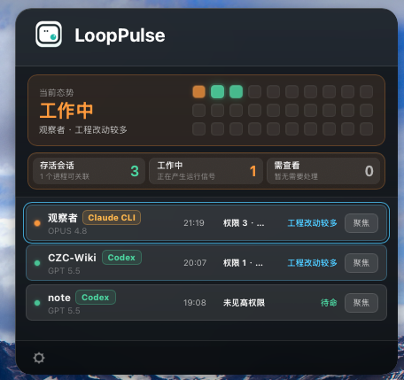

<div align="center">


# LoopPulse

**A macOS menu bar app that keeps an eye on your local AI coding agents.**

See at a glance whether Claude Code, Codex, or OpenCode is working, stalled,
rate-limited, or about to hit its quota — without leaving your keyboard.

English | [简体中文](README.zh-CN.md)


</div>

<!--
  Screenshot placeholder — drop a panel/menu-bar screenshot at docs/screenshot.png
  and uncomment the line below.
  
-->

<div align="center">
  
</div>

---

## What it does

When you run multiple AI coding agents in the background, it's easy to lose track:
is it still thinking, did it stall, did it get rate-limited, is it waiting for you to
approve a command? LoopPulse lives in your menu bar and answers that at a glance.

It reads **local data only** — session transcripts, process state, ports — and never
uploads anything.

## Features

- **Menu bar panel** — a CleanMyMac-style panel slides in from the tray icon, follows
  you across Spaces, and tucks away when it loses focus.
- **Multi-agent monitoring** — Claude Code (`~/.claude`), Codex CLI (`~/.codex`), and
  OpenCode (local SQLite) in one place.
- **Status at a glance** — working / thinking / waiting / rate-limited / stalled /
  error / done, with model, project, runtime, token usage, and context %.
- **Risk engine** — surfaces suspected hangs (multi-signal, not just elapsed time),
  rate limits, command/permission errors, leftover ports, port conflicts, and quota
  pressure (two configurable thresholds).
- **Desktop notifications** — fire on high/attention risks with per-session cooldown;
  click through to the session detail.
- **Global hotkey** — summon or dismiss the panel with **⌥Q** (customizable), so a
  notch-hidden tray icon never traps you.
- **Focus a terminal** — jump to the matching Terminal/iTerm window for any session.
- **Local history** — events persist in a local SQLite database with a configurable
  retention window.
- **Privacy first** — prompt and message bodies are never shown; paths can be
  redacted, shortened, or shown in full.

## Privacy

LoopPulse only reads data already on your machine and makes **no network requests** with
your code or session content. Nothing is uploaded, cached remotely, or shared.

## Requirements

- macOS 12.0 (Monterey) or later
- Apple Silicon (M-series). Intel Macs are untested.

## Install

Download the latest `.dmg` from [Releases](../../releases), open it, and drag
**LoopPulse** to Applications.

The build is currently **unsigned** (no Apple Developer account yet), so Gatekeeper
will warn on first launch. To open it anyway:

- **Right-click** `LoopPulse.app` → **Open** → **Open** in the dialog, or
- Run once: `xattr -dr com.apple.quarantine /Applications/LoopPulse.app`

On first launch LoopPulse asks for notification permission and walks you through a short
onboarding.

## Build from source

Prerequisites: [Rust](https://rustup.rs) (cargo + rustc), Node.js, and
[pnpm](https://pnpm.io).

```bash
pnpm install

# Run in development
pnpm tauri dev

# Build a release bundle (.app + .dmg under src-tauri/target/release/bundle/)
pnpm tauri build
```

Code signing and notarization are optional and gated behind environment variables; see
[`docs/release/macos-release.md`](docs/release/macos-release.md).

## Tech stack

- **Frontend** — [Svelte 5](https://svelte.dev) (runes) + TypeScript +
  [Vite 6](https://vitejs.dev)
- **Shell** — [Tauri 2](https://tauri.app) (Rust)
- **Key crates** — [`tauri-nspanel`](https://github.com/ahkohd/tauri-nspanel) (menu bar
  panel behavior), `tauri-plugin-global-shortcut`, `rusqlite` (local history), and
  `objc2` / `objc2-app-kit` for native `NSStatusItem` integration.

LoopPulse leans on macOS-private AppKit APIs (`NSStatusItem`, floating `NSPanel`,
cross-Space behavior), which is why it is macOS-only.

## Project structure

```
src/                 Svelte frontend (panel, dashboard, onboarding)
src-tauri/src/       Rust backend
  agents/            Claude Code / Codex / OpenCode collectors
  lib.rs             tray, panel, global shortcut, app wiring
  settings.rs        persisted settings
  events.rs          local SQLite event history
  notifications.rs   risk → notification logic
docs/                product (PRD), design notes, release runbook
```

## Contributing

Issues and PRs are welcome. For build, signing, and release details, see
[`docs/release/macos-release.md`](docs/release/macos-release.md). The product spec lives
in [`docs/PRD.md`](docs/PRD.md).

## License

[MIT](LICENSE) © 2026 SegawaBeer

## Acknowledgements

Built to watch over [Claude Code](https://www.anthropic.com/claude-code),
[Codex](https://openai.com/codex), and [OpenCode](https://opencode.ai). The menu bar
behavior stands on [ahkohd](https://github.com/ahkohd)'s excellent `tauri-nspanel` and
`tauri-toolkit`.

