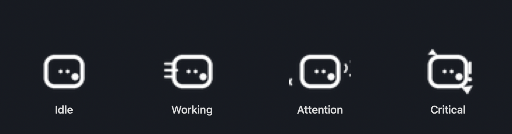

<div align="center">


# LoopPulse

**一个常驻 macOS 菜单栏、帮你盯住本机 AI 编码 Agent 的小工具。**

一眼看清 Claude Code、Codex、OpenCode 此刻是在干活、卡住了、被限流，还是快到额度上限——
不用离开键盘。

[English](README.md) | 简体中文


</div>

<!--
  截图占位 —— 把面板/菜单栏截图放到 docs/screenshot.png，并取消下一行注释。
  
-->

<div align="center">
  
</div>

---

## 它解决什么

后台同时跑好几个 AI 编码 Agent 时，状态很容易失控：它还在思考吗？是不是卡住了？被限流了？
还是在等你批准某条命令？LoopPulse 常驻菜单栏，一眼帮你看清这些。

它**只读取本机数据**——会话记录、进程状态、端口——不上传任何内容。

## 功能

- **菜单栏面板**——CleanMyMac 风格的面板从托盘图标滑入，跨 Space 跟随，失焦自动收起。
- **状态感知托盘图标**——菜单栏图标随当前最严重的状态变化，不打开面板也能知道有没有事找你。
- **多 Agent 监控**——Claude Code（`~/.claude`）、Codex CLI（`~/.codex`）、OpenCode（本地 SQLite）
  统一查看。
- **状态一目了然**——工作中 / 思考 / 等待 / 限流 / 假死 / 错误 / 完成，附带模型、项目、运行时长、
  Token 用量与上下文百分比。
- **风险引擎**——识别疑似假死（多信号判断，而非只看耗时）、限流、命令/权限错误、端口残留、
  端口冲突、额度预警（两档可配置阈值）。
- **桌面通知**——高危/注意级风险触发通知，同会话同类告警有冷却去重，点击可跳转会话详情。
- **全局快捷键**——按 **⌥Q**（可自定义）随时唤起/收回面板，菜单栏图标被刘海挡住也不怕。
- **聚焦终端**——一键把任意会话对应的 Terminal/iTerm 窗口拉到前台。
- **本地历史**——事件记录持久化在本地 SQLite，保留时间可配置。
- **隐私优先**——从不展示 prompt 和消息正文；路径可脱敏、简略或完整显示。

### 托盘图标一眼读状态

菜单栏图标会反映所有会话中最严重的当前状态——空闲、工作中、需查看、高危——让你在真正需要介入前都能安心专注。

<div align="center">
  
</div>

## 隐私

LoopPulse 只读取本机已有的数据，**不会**就你的代码或会话内容发起任何网络请求。不上传、不远程缓存、
不分享。

## 系统要求

- macOS 12.0（Monterey）及以上
- Apple Silicon（M 系列芯片）。Intel Mac 未经测试。

## 安装

从 [Releases](../../releases) 下载最新 `.dmg`，打开后把 **LoopPulse** 拖到「应用程序」。

当前构建**未签名**（暂无 Apple Developer 账号），首次启动 Gatekeeper 会拦截。两种打开方式：

- **右键** `LoopPulse.app` → **打开** → 在弹窗里再点 **打开**；或
- 执行一次：`xattr -dr com.apple.quarantine /Applications/LoopPulse.app`

首次启动会请求通知权限，并带你走一遍简短的引导。

## 从源码构建

前置依赖：[Rust](https://rustup.rs)（cargo + rustc）、Node.js、[pnpm](https://pnpm.io)。

```bash
pnpm install

# 开发运行
pnpm tauri dev

# 打包发布版（.app + .dmg 输出到 src-tauri/target/release/bundle/）
pnpm tauri build
```

代码签名与公证为可选项，由环境变量控制，详见
[`docs/release/macos-release.md`](docs/release/macos-release.md)。

## 技术栈

- **前端**——[Svelte 5](https://svelte.dev)（runes）+ TypeScript + [Vite 6](https://vitejs.dev)
- **外壳**——[Tauri 2](https://tauri.app)（Rust）
- **关键 crate**——[`tauri-nspanel`](https://github.com/ahkohd/tauri-nspanel)（菜单栏面板行为）、
  `tauri-plugin-global-shortcut`、`rusqlite`（本地历史），以及 `objc2` / `objc2-app-kit`
  用于原生 `NSStatusItem` 集成。

LoopPulse 依赖 macOS 私有 AppKit API（`NSStatusItem`、浮动 `NSPanel`、跨 Space 行为），
因此仅支持 macOS。

## 项目结构

```
src/                 Svelte 前端（面板、完整视图、引导）
src-tauri/src/       Rust 后端
  agents/            Claude Code / Codex / OpenCode 采集器
  lib.rs             托盘、面板、全局快捷键、应用装配
  settings.rs        持久化设置
  events.rs          本地 SQLite 事件历史
  notifications.rs   风险 → 通知逻辑
docs/                产品（PRD）、设计笔记、发布手册
```

## 参与贡献

欢迎提 Issue 和 PR。构建、签名、发布细节见
[`docs/release/macos-release.md`](docs/release/macos-release.md)，产品规格见
[`docs/PRD.md`](docs/PRD.md)。

## 许可证

[MIT](LICENSE) © 2026 SegawaBeer

## 致谢

为守望 [Claude Code](https://www.anthropic.com/claude-code)、[Codex](https://openai.com/codex)、
[OpenCode](https://opencode.ai) 而生。菜单栏行为得益于 [ahkohd](https://github.com/ahkohd)
出色的 `tauri-nspanel` 与 `tauri-toolkit`。
