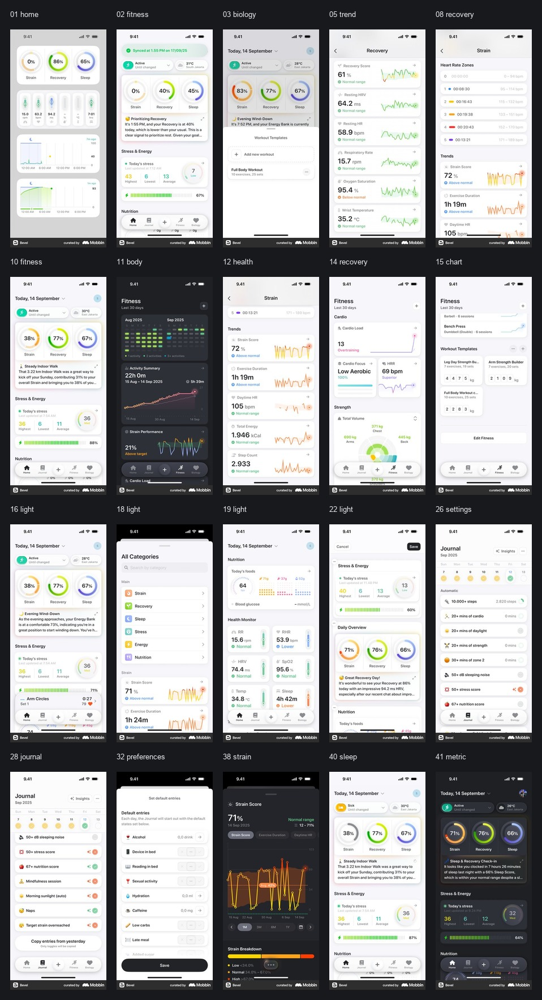
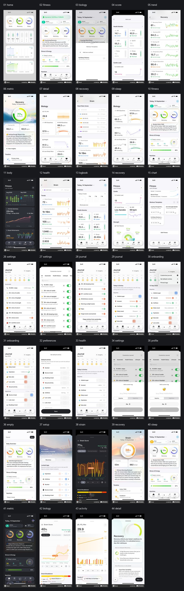
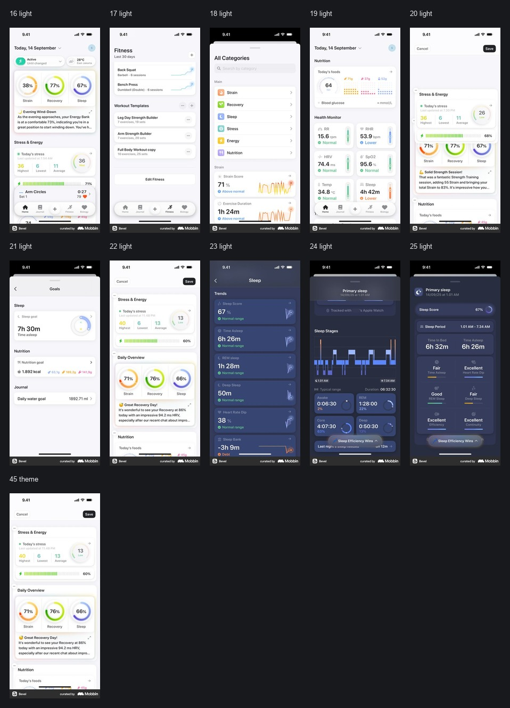

# Bevel Reference Board

Date: 2026-06-08
Source: Mobbin iOS screens
Purpose: Extract reusable visual and interaction patterns for the Observer Bevel-style UI refresh.

## Contact Sheets

Core references:

Dark theme references:

Light theme references:

## What We Are Borrowing

- A calm health-dashboard structure: one screen is a stack of focused metric cards, not a dense control panel.
- Metric-first cards: each card pairs a large value with a time range, a trend, and a small qualitative label.
- Dark theme hierarchy: near-black page background, slightly lifted graphite cards, subtle borders, restrained shadows.
- Functional color, not decoration: green for healthy or complete, amber for load or attention, pink/red for strain or risk, cyan/blue for secondary trend signals.
- Soft motion: cards should feel like they settle into place; trend charts should update smoothly without calling attention to themselves.
- Tight text economy: titles and numbers lead, supporting text stays short.
- Bottom operations: frequent navigation and actions are compact, icon-led, and low contrast until active.

## What We Should Not Copy Directly

- Do not copy Bevel branding, names, icons, or exact chart compositions.
- Do not turn Observer into a mobile app layout. The menu panel is still a macOS utility panel.
- Do not introduce theme switching in the first UI pass. Extract light tokens now, implement dark first.
- Do not sacrifice scan density. Observer users may monitor several sessions at once.

## Mapping To Observer

| Bevel Pattern | Observer Equivalent |
| --- | --- |
| Fitness / Biology top-level tabs | Panel Home / Session Detail / Dashboard / Settings |
| Activity Summary | Active session time, tool activity, task progress |
| Strain Performance | Token burn, context pressure, high-risk load |
| Calendar heatmap | Sampling heatmap for recent agent health, activity, and risk |
| Recovery score | Global health score or selected session health |
| Sleep / strain trend chart | Context and token history |
| Journal | Event timeline and diagnostic history |
| Settings / profile | Monitor settings, privacy, data roots, alerts |

## Recommended Design Tokens

Dark theme first:

| Token | Suggested Value | Usage |
| --- | --- | --- |
| `--surface-page` | `#1b1d22` | transparent-panel visible base |
| `--surface-card` | `#2b2e36` | primary metric cards |
| `--surface-card-soft` | `#24272e` | secondary list rows |
| `--border-soft` | `rgba(255,255,255,0.075)` | card outlines |
| `--text-primary` | `rgba(255,255,255,0.94)` | numbers and titles |
| `--text-secondary` | `rgba(255,255,255,0.58)` | labels |
| `--text-muted` | `rgba(255,255,255,0.36)` | helper/meta text |
| `--status-ok` | `#8ee85f` | healthy/completed |
| `--status-work` | `#ffb24d` | executing/token load |
| `--status-warn` | `#ff8d5c` | warning |
| `--status-critical` | `#ff5c7a` | critical |
| `--status-info` | `#59c7ff` | info/secondary |

Geometry:

| Token | Suggested Value | Usage |
| --- | --- | --- |
| `--panel-radius` | `18px` | preserve current CleanMyMac-like panel |
| `--card-radius` | `11px` | compact metric cards |
| `--control-radius` | `999px` | pills and segmented controls only |
| `--panel-padding` | `14px` | panel inner padding |
| `--card-gap` | `8px` | vertical card stack |

Motion:

| Token | Suggested Value | Usage |
| --- | --- | --- |
| `--ease-soft` | `cubic-bezier(0.22, 1, 0.36, 1)` | preserve current slide feel |
| `--duration-panel` | `460ms` | panel enter |
| `--duration-card` | `260ms` | card stagger |
| `--duration-metric` | `420ms` | chart/meter update |

## Core Screen Index

| # | Local File | Mobbin |
| --- | --- | --- |
| 01 | [Home overview](screens/01-home-overview-45777953-3f7c-40ce-8675-09b3ec5bd8fd.jpg) | [Mobbin](https://mobbin.com/screens/45777953-3f7c-40ce-8675-09b3ec5bd8fd) |
| 02 | [Fitness dashboard](screens/02-fitness-dashboard-746c3b08-afd9-4790-945c-ac254f31f41c.jpg) | [Mobbin](https://mobbin.com/screens/746c3b08-afd9-4790-945c-ac254f31f41c) |
| 03 | [Biology metrics](screens/03-biology-metrics-86de6d2a-c026-429a-8d4e-cd7fa6e79009.jpg) | [Mobbin](https://mobbin.com/screens/86de6d2a-c026-429a-8d4e-cd7fa6e79009) |
| 05 | [Trend detail](screens/05-trend-detail-cf175d8e-0c46-4461-90cb-3c5163d9349a.jpg) | [Mobbin](https://mobbin.com/screens/cf175d8e-0c46-4461-90cb-3c5163d9349a) |
| 08 | [Recovery chart](screens/08-recovery-chart-4398dbfe-241b-4880-b6ef-9eafaab69861.jpg) | [Mobbin](https://mobbin.com/screens/4398dbfe-241b-4880-b6ef-9eafaab69861) |
| 10 | [Fitness summary](screens/10-fitness-summary-25b9fe4f-75e9-4341-b9cd-4905f17fda56.jpg) | [Mobbin](https://mobbin.com/screens/25b9fe4f-75e9-4341-b9cd-4905f17fda56) |
| 11 | [Body metrics](screens/11-body-metrics-ac7933a1-0142-40f5-9b84-41c875470981.jpg) | [Mobbin](https://mobbin.com/screens/ac7933a1-0142-40f5-9b84-41c875470981) |
| 12 | [Health detail](screens/12-health-detail-e623a489-a3b6-4741-a997-889fad8d88ed.jpg) | [Mobbin](https://mobbin.com/screens/e623a489-a3b6-4741-a997-889fad8d88ed) |
| 14 | [Recovery score](screens/14-recovery-score-70391296-e949-458c-aa02-d4d0dd63df76.jpg) | [Mobbin](https://mobbin.com/screens/70391296-e949-458c-aa02-d4d0dd63df76) |
| 15 | [Chart detail](screens/15-chart-detail-46de69b2-0e18-4cfd-aa58-2ed105de769b.jpg) | [Mobbin](https://mobbin.com/screens/46de69b2-0e18-4cfd-aa58-2ed105de769b) |
| 16 | [Light overview](screens/16-light-overview-3efccafc-ab77-4337-bd01-bca034aa3ee6.jpg) | [Mobbin](https://mobbin.com/screens/3efccafc-ab77-4337-bd01-bca034aa3ee6) |
| 18 | [Light detail](screens/18-light-detail-825e37e3-9335-4603-8774-d18ecf2341fb.jpg) | [Mobbin](https://mobbin.com/screens/825e37e3-9335-4603-8774-d18ecf2341fb) |
| 19 | [Light chart](screens/19-light-chart-02e8b87e-6396-48a4-b3d1-93ff9cd0fb40.jpg) | [Mobbin](https://mobbin.com/screens/02e8b87e-6396-48a4-b3d1-93ff9cd0fb40) |
| 22 | [Light settings](screens/22-light-settings-60e6a8e9-0795-4da6-bad7-77f30c2ddee0.jpg) | [Mobbin](https://mobbin.com/screens/60e6a8e9-0795-4da6-bad7-77f30c2ddee0) |
| 26 | [Settings main](screens/26-settings-main-ef31943c-df1d-405b-8436-0ba766143ffc.jpg) | [Mobbin](https://mobbin.com/screens/ef31943c-df1d-405b-8436-0ba766143ffc) |
| 28 | [Journal list](screens/28-journal-list-f86b9179-90db-4978-9740-b5218f6419a1.jpg) | [Mobbin](https://mobbin.com/screens/f86b9179-90db-4978-9740-b5218f6419a1) |
| 32 | [Preferences](screens/32-preferences-c0b07cb7-fea5-4384-8a0a-d13801b11574.jpg) | [Mobbin](https://mobbin.com/screens/c0b07cb7-fea5-4384-8a0a-d13801b11574) |
| 38 | [Strain detail](screens/38-strain-detail-b271720b-cd60-4bb1-bbf1-4d5ead7a3984.jpg) | [Mobbin](https://mobbin.com/screens/b271720b-cd60-4bb1-bbf1-4d5ead7a3984) |
| 40 | [Sleep chart](screens/40-sleep-chart-2d3e8d5f-f3f1-4370-8b34-f914c8eb31ed.jpg) | [Mobbin](https://mobbin.com/screens/2d3e8d5f-f3f1-4370-8b34-f914c8eb31ed) |
| 41 | [Metric trend](screens/41-metric-trend-3fe55859-fa16-4472-bd7a-46cf38791850.jpg) | [Mobbin](https://mobbin.com/screens/3fe55859-fa16-4472-bd7a-46cf38791850) |

## Full Screen Inventory

All downloaded references are stored in [screens](screens/). The file prefix is the reference number used by the contact sheets.

