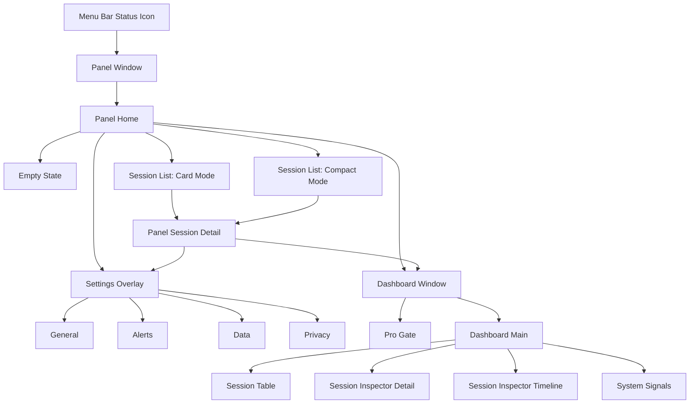

# LoopPulse UX Map

Date: 2026-06-08
Branch: `codex/bevel-ui-refresh`
Baseline protection: branch `backup/pre-bevel-ui`, tag `pre-bevel-ui-20260608`

## Current Product Shape

LoopPulse is not a routed web app. It has two Tauri windows and several state-driven views inside `src/App.svelte`.

## Window And View Inventory

| Area | View | Current Function | Bevel Refresh Direction | Risk |
| --- | --- | --- | --- | --- |
| Menu bar | Status icon | Shows global risk/active state and opens panel | Keep behavior, later replace icon assets only | Low |
| Panel | Home header | App name, overall status, total sessions, active, token | Convert into health-dashboard title with global health card | Medium |
| Panel | Summary strip | Active / critical / warning / token counters | Replace with Bevel-like compact metric cards and optional heatmap | Medium |
| Panel | Empty state | No active sessions | Keep simple, restyle with quieter Bevel surface | Low |
| Panel | Session list card mode | Project, status, summary, context, token, risk | Convert cards into metric-first session cards | Medium |
| Panel | Session list compact mode | Dense rows for many sessions | Preserve density; apply Bevel row styling | Low |
| Panel | Session detail | Selected session health, context/token, risks, env, tools | Turn sections into stacked metric cards with trend modules | High |
| Panel | Settings overlay | Plan, tabs, monitoring, alerts, data, privacy | Restyle last; preserve fields and logic | Medium |
| Dashboard | Pro Gate | Locks full dashboard for Free users | Restyle with product-grade upgrade card later | Low |
| Dashboard | Main | Sidebar, filters, KPIs, session table, inspector | Convert to desktop health console; bigger card grid and trend panels | High |
| Dashboard | Inspector detail | Deep per-session diagnostics | Reuse panel detail card system | Medium |
| Dashboard | Timeline | Session/global event timeline | Map to Bevel journal pattern | Medium |
| Dashboard | System signals | MCP, quota, orphan ports, risk feed | Map to Bevel settings/list pattern | Medium |

## Current Functional Ownership

| Function | Primary View | Secondary View |
| --- | --- | --- |
| Overall health | Panel Home | Dashboard sidebar / KPIs |
| Active session scan | Panel Session List | Dashboard Session Table |
| Session investigation | Panel Session Detail | Dashboard Inspector |
| Risk explanation | Panel Detail Risk Reasons | Dashboard Inspector / Risk feed |
| Context and token history | Panel Detail Process Signals | Dashboard Inspector |
| Tool timeline | Panel Detail Process Signals | Dashboard Inspector |
| File access | Panel Detail Process Signals | Dashboard Inspector |
| Git, ports, child processes | Panel Detail Environment Signals | Dashboard Inspector / System Signals |
| Notifications | Settings Alerts | System notifications |
| Data roots | Settings Data | None |
| Privacy / remote preview | Settings Privacy | None |
| Pro gating | Settings plan card / Dashboard Pro Gate | Locked controls |

## Proposed Bevel Component System

These should be built before touching every view.

| Component | Purpose | First Use |
| --- | --- | --- |
| `HealthHero` | Overall health score/status, last update, session count | Panel Home |
| `MetricCard` | Large value + label + sublabel + optional meter/chart | Panel Home, Detail |
| `ActivityHeatmap` | Recent health/activity/risk samples | Panel Home |
| `TrendCard` | Line/bars for token/context history | Panel Detail |
| `SessionMetricRow` | Dense session row preserving scan speed | Panel compact list |
| `RiskReasonCard` | Risk title, severity, evidence, Pro marker | Panel Detail |
| `SignalCardGrid` | Git/ports/process/MCP compact diagnostics | Detail and Dashboard |
| `BevelTabBar` | Low-contrast segmented nav | Settings and Dashboard inspector |
| `ActionDock` | Compact bottom actions | Panel footer |

## Data Mapping For First UI Pass

| UI Element | Existing Data |
| --- | --- |
| Global health label | `overallStatus()` |
| Global active count | `activeCount` |
| Global risk count | `criticalCount`, `warningOnlyCount`, `warningCount` |
| Total token | `totalTokenCount` |
| Session title | `sessionTitle(session)` |
| Conversation title | `conversationTitle(session)` |
| Context value | `contextLabel(session)`, `pressureLabel(session)` |
| Meter width | `contextMeterValue(session)` |
| Token value | `totalTokens(session)` |
| Recent activity | `formatRelative(session.last_activity_at)` |
| Tool activity | `session.tool_calls`, `recentToolCalls()` |
| Context chart | `session.context_history`, `historyBars()` |
| Token chart | `session.token_history`, `historyBars()` |
| Risks | `session.risks`, `riskColor()`, `riskLabel()` |
| Environment | `git`, `ports`, `children`, `subagents`, `memory` |

## Implementation Order

1. Add design tokens in `src/App.svelte` CSS first. No markup changes.
2. Add small pure UI helpers for heatmap/trend data. No backend changes.
3. Refresh Panel Home only.
4. Refresh Panel Session Detail.
5. Refresh Settings overlay lightly.
6. Refresh Dashboard main and inspector.
7. Run full verification and compare with baseline.

## Rollback Plan

Stable baseline is protected by:

- Branch: `backup/pre-bevel-ui`
- Tag: `pre-bevel-ui-20260608`
- Commit: `4dc8553 feat: complete agent monitor milestone`

Recommended commit slices:

1. `docs: add bevel reference board and ux map`
2. `refactor(ui): add bevel design tokens`
3. `feat(ui): refresh panel overview`
4. `feat(ui): refresh panel session detail`
5. `feat(ui): refresh dashboard health layout`

Rollback options:

- Revert one commit if a stage is wrong.
- Keep a `classic` CSS block while testing a `bevel` block if comparison becomes necessary.
- Switch to `backup/pre-bevel-ui` if the whole direction needs to be abandoned.

## Acceptance Checks For UI Refresh

- Panel still opens from the correct menu bar position on main and secondary displays.
- Panel visible size and top/right spacing remain unchanged unless explicitly retuned.
- Text does not overflow in Chinese or English labels.
- At least four sessions remain scannable in panel compact mode.
- Empty state, settings overlay, selected detail, Pro locked dashboard all remain reachable.
- `pnpm build`, `cargo fmt --check`, `cargo test`, `git diff --check`, and `pnpm tauri build --debug` pass before commit.

